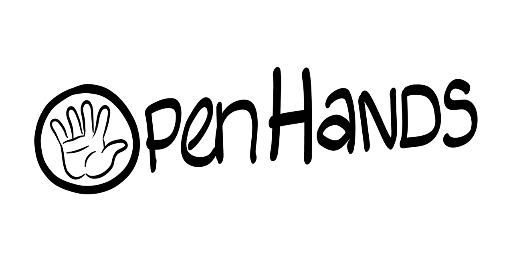

 
# OpenHands 
OpenHands is a gesture recognition system powered by [OpenPose](https://github.com/CMU-Perceptual-Computing-Lab/openpose), k-nearest neighbours, and local outlier factor.  Currently the system can identify thumbs up, peace, palm, and out of distribution hand gestures of right hands. 

## :clapper:  Video demo
[Watch a demo](https://www.youtube.com/watch?v=QSDZ-cdyGXw) of OpenHands being used in the camera web app Jester (app code in /examples directory).

## :memo:  Documentation
* [Installation instructions](https://github.com/PaulTreanor/OpenHands/blob/main/docs/installation.md)
* [Technical manual](docs/technical_spec)
* [Testing report](https://github.com/PaulTreanor/OpenHands/blob/initial-commits/docs/testing_report.pdf)

## :taxi:  Roadmap
#### Short term
1. Record more accuracy and performance metrics. 
2. Implement github actions testing pipeline. 
3. Improve documentation. 

#### Longer term 
* Improve performance 
	1. KNN approximations.
	2. Keypoint dimension reduction.
	3. Implement classifier in C. 
* Left hand gesture support. 
* SDK for adding custom gestures. 

## :clipboard:  Contributing
I'm not currently looking for contributors, but feedback is always welcome!

## :balance_scale:  License 
OpenHands uses the GPLv3 license. This means you are free to make copies, modify, and distributed OpenHands, just make the source code available. Full details of the GPLv3 license can be found [here](https://github.com/PaulTreanor/OpenHands/blob/main/LICENSE).

## :pencil2:  Author
**Paul Treanor** 
* Email: paul.treanor5@mail.dcu.ie
* Github: [@paultreanor](https://github.com/PaulTreanor)

## :clap:  Acknowledgements 
- Thanks to [Colin Gorman](https://ie.linkedin.com/in/colin-gorman-037b67181) for help with the dataset collection, dataset processing, and system testing.
- Credit to [Róise McGagh](https://ie.linkedin.com/in/r%C3%B3ise-mcgagh) for the fantastic artwork!
