# Technical Specification 

The OpenHands classifier uses OpenPose for keypoint detection, and then applies a series of standardisation and classification algorithms to the outputted keypoint data to produce a gesture classification.

All code in this document is pseudocode. 

## The OpenHands Dataset

#### Dataset details
The OpenHands hand gesture dataset consists of keypoint coordinates data of 1744 images from 13 people doing 3 hand gestures (peace sign, thumbs up, and stop). The collected images are not available because participants who provided images for the dataset agreed that the images would not be stored or made publicly available. 

The dataset can be found at `/src/dataset/data-collection/gestures_json_dataset.zip`.

#### Dataset collection
The dataset required a large amount of images to limit the impact of variance [1] . Larger and more diverse datasets produce classifiers which tolerate more variation in how individuals make hand gestures.  An effort was also made to ensure that each hand gesture appeared an even amount of times in the dataset to limit the effect of sample bias.

Once the images were collected, they were sorted into folders according to the hand gesture, and a scripts was run to rename all the images according to the name of their parent folder. This made creating a class field in a CSV dataset much easier. 

A script then placed each image in a folder (required to avoid OpenPose memory issues), and ran OpenPose on that folder to get the keypoint data of the image in a JSON file.

The scripts used in the dataset collection phase can be found in the `/src/dataset/dataset-collection` directory.

## Dataset Preprocessing 
The dataset required cleaning and standardisation in order to train a model.

#### Dataset cleaning 
The dataset_cleaning.py script placed the JSON keypoint data into one convenient CSV file only containing right hand keypoints (OpenPose outputs the keypoint data for the entire body of a person in each image).

<figure>
  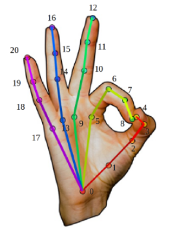
  <figcaption>OpenPose hand keypoints (credit: OpenPose)</figcaption>
</figure>

\
&nbsp;

<figure>
  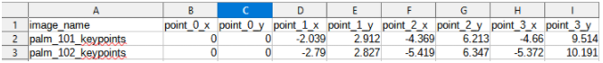
  <figcaption>Snippet of training set CSV file showing coordinate values</figcaption>
</figure>

\
&nbsp;

The CSV file fields for x and y coordinates for each of the 21 keypoints OpenPose detects in the hand. Each item also has a “class” attribute, which is either “peace”, “palm”, or “thumbs_up” and is assigned based on the file name of the item’s corresponding JSON file.

The script then removed inconsistent data from the CSV file. Items in the dataset with null values for keypoints were removed. These corresponded to blurry images.

#### Data transformation algorithms 
Data transformations were carried to change the data into a homogeneous form that would allow for more accurate machine learning [2].  Transformation algorithms were developed to standardise the size, position, and orientation of the keypoint distribution for each item in the dataset. The code that implements these transformations can be found in `data_transformer.py`.

##### Translate 
The translate() method moves the 0th keypoint (the wrist) of each item to the origin.
<figure>
  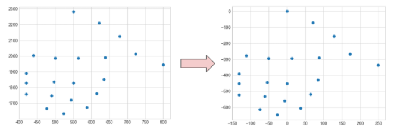
</figure>


##### Enlarge
The enlarge() method standardises the distance between 0th and 9th keypoint (the keypoints corresponding to the wrist and the base of the middle finger) of each item to 10 units.

<figure>
  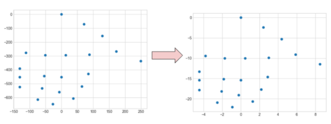
</figure>


##### Rotate
The rotate() method rotates all the keypoint coordinates around the origin so that the 0th and 9th point both lie on the y-axis. The rotate method is based on a rotation matrix.

<figure>
  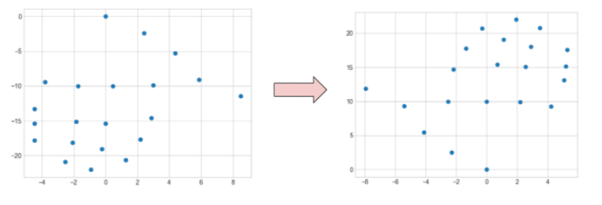
</figure>


##### Sum of transformation algorithms:

<figure>
  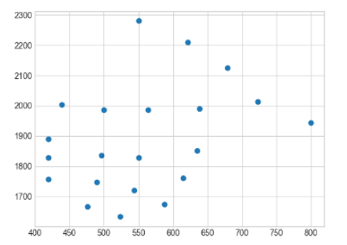
  <figcaption>Before transformations</figcaption>
</figure>


<figure>
  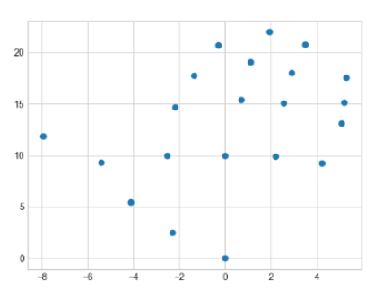
  <figcaption>After transformations</figcaption>
</figure>


## System Architecture 

The classification system uses a pipeline design pattern, which accepts an image as an input (from the network API), and outputs a classification.

1.  OpenPose detects hand keypoints in image
2.  Keypoint coordinates are converted from JSON into a Python list.
3.  The coordinates are standardised using the same translate, rotate, and enlarge algorithms as described in section 5.4.2.   
4.  The coordinates list is classified by the KNN algorithm.  
5.  A confidence value is determined using Local outlier factor (which uses KNN).
    
If OpenPose does not detect a complete set of right hand keypoint in an image, an OOD classification is returned by the pipeline. If OpenPose’s confidence values for keypoint coordinates is below a threshold, an OOD classification is returned.

<figure>
  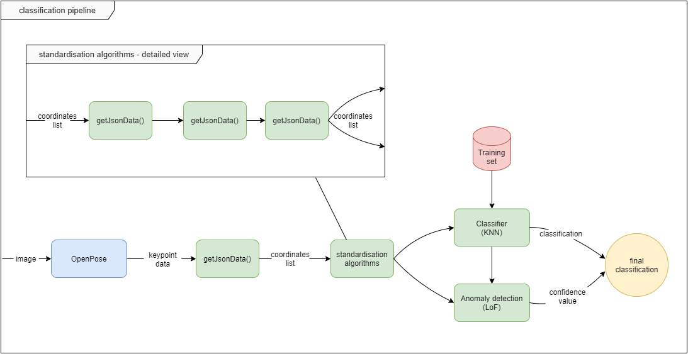
  <figcaption>The processes that make up the classifier pipeline</figcaption>
</figure>


### Keypoint detection
OpenHands incorporates the 3rd party keypoint detection system OpenPose to extract keypoint coordinates. It is this keypoint data that the OpenHands algorithms manipulate and classify. There are a range of existing projects that can detect keypoints of people in images, including OpenPose and OpenVino. Several approaches to keypoint detection were tested by the authors, but OpenPose was settled on because of its out of the box support for hand keypoint detection.

### Standardisation algorithms
The classifier uses the same translate, enlarge, and rotate classification algorithms that were used in the dataset preprocessing stage. These algorithms allow for the keypoint data of images to be compared to the dataset of items.

### K-nearest neighbours
The advantages of KNN are accuracy and the wide variety of anomaly detection methods that can be achieved through modifying/integrating KNN. This was an important consideration as in real world applications such as device control with gestures, most inputs would be out of distribution.

The main drawback of KNN is performance, but there was reason to believe that this would not be an issue as the training set used was relatively small, with under 1800 items. There’s also potential optimisations to improve KNN’s performance in future releases which are being considered.

##### Finding the optimal value for K
It was important to select an optimum value for K, the number of nearest neighbours examined by the algorithm. If the value is too low the classifier would be strongly influenced by noise and outliers in the data, but higher values are computationally expensive.

The script find_best_knn.py was written to find the optimum value for K. The script randomly divides the keypoint dataset into an 80/20 split between the training set and a test set. The script then classifies the test set items using a 3rd party library KNN implementation 100 times, iterating through values for K between 1 and 100.

```python
def find_best_k():
	k = 1
	max_accuracy = 0
	best_k = 0
	while k < 100:
		classifier, accuracy = knn(k)
		if accuracy > max_accuracy:
			max_accuracy = accuracy
			best_k = k
		k +=1
	print(best_k)
```

A potential reason why low values were more accurate is because the training and test data all came from the same dataset, which has less variation and noise than real world gesture images. With that in mind, 5 was selected as the value for K as it is on the higher side of the optimum 1-5 range that the script suggested.

<figure>
  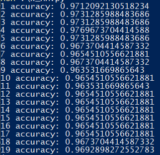
  <figcaption>Output of find_best_k()</figcaption>
</figure>

##### Implementing KNN

```python
def knn_classifier(inputItem):
	nearest_neighbours = []  # list of tuples (item, distance)
	for item in trainingSet 
		distance = getDistance(inputItem, item)
		if length(nearest_neighbours) < k:
			nearest_neighbours.add(item)
		if distance < max [distance for neighbour in nearest_neighbours]:
			remove most distant neighbour in nearest_neighbours
			nearest_neighbours.add(item, distance)
	neighbour_classes = []
	for item in neighbours:
		neighbour_classes.add(item[class])
	classification = most frequent class in neighbour_classes
	return classification
```

The Jester implementation of KNN can be found in `knn.py`. KNN is implemented as a class with the attributes k, and dataframe (the training set). The implementation uses the euclidean distance as the distance function.

### Out-of-distribution detection
As well as being able to classify hand gestures, the classifier can also assert if an image does not contain a known hand gesture. This is known as out-of-distribution detection or anomaly detection.

A range of potential anomaly detection algorithms were considered. Each algorithm was implemented to be tested and can be found in the conf_functions.py program.

##### Local outlier Factor (LOF)

The KNN, KthNN,local distance outlier factor, and local outlier factor algorithms were tested for anomaly detection and local outlier factor was implemented as it was the most accurate algorithm in testing.

##### Local outlier factor implementation
Local outlier factor is an anomaly detection algorithm which compares the local density of the item being classified with the local density of each of the item’s k nearest neighbours. Density is the average distance between items in an area (in this case, the area is the radius around an item which includes the k nearest neighbours). If the local density of an item is considerably less than the local density of an item’s neighbours, then the item is considered to be an outlier. If an item is an outlier then there is less confidence that it has the same classification as its k nearest neighbours, and so it is classified as being out-of-distribution.
  
The implementation of the LOF was developed based on the mathematical notation representation from the Breunig and Kriegal 2000 study which proposed the algorithm [3]. The code can be found in `conf_functions.py`. 

This implementation of LOF takes 4 arguments:
- A (the item to be classified, as a list of features)
- a list of A's nearest neighbours
- an instance of the KNN classifier
- a value for K

The algorithm is split into 3 methods corrosponding to the 3 maths functions from the algorithm's Wikipedia page. 

##### 1. Reachability distance 

<figure>
  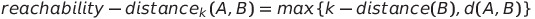
  <figcaption>The reachability distance between items A and B is the distance between B and it's Kth nearest neighbour or the distance between A and B (whichever is larger).</figcaption>
</figure>

\
&nbsp;

```python
def  reachability_distance(A, B, classifier, k):
	B_n_neighbours = classifier.get_knn(B[2])
	k_dist = max([distance.euclidean(B[2], n[2]) for n in B_n_neighbours])
	AB_dist = distance.euclidean(A, B[2])
	r_distance = max(k_dist, AB_dist)
	return r_distance
```
##### 2. Local reachability density 

<figure>
  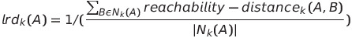
  <figcaption>Local reachability density is the inverse of the average reachability distance between A and each of it's K nearest neighbours.</figcaption>
</figure>

\
&nbsp;

```python
def  local_r_density(A, nearest_neighbours, classifier, k): # Local reachability density
	r_distance_list = []
	for B in nearest_neighbours:
		B_r_distance = rDistance(A, B, classifier, k)
		r_distance_list.append(B_r_distance)
	avg_r_distance = sum(r_distance_list)/k
	local_r_density = 1.0/avg_r_distance
	return local_r_density
```
##### 3. Local outlier factor
<figure>
  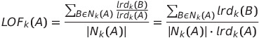
  <figcaption>The local outlier factor of object A can then be defined as the average local reachability-density of each of A’s neighbours divided by the local reachability-density of A.</figcaption>
</figure>

\
&nbsp;

```python
def  local_outlier_factor(A, nearest_neighbours, classifier, k):
	A_local_r_density = local_r_density(A, nearest_neighbours, classifier, k)
	local_r_density_list = []
	for B in nearest_neighbours:
		B_n_neighbours = classifier.get_knn(B[2])
		B_local_r_density = local_r_density(B, B_n_neighbours, classifier, k)
		local_r_density_list.append(B_local_r_density)
	local_r_density_total = sum(local_r_density_list)
	divisor = A_local_r_density*k
	local_outlier_factor = local_r_density_total/divisor
	local_outlier_factor = -local_outlier_factor
	return local_outlier_factor
```

### Optimising KNN and LOF 
The KNN and LOF implementations were profiled to identify bottlenecks. It was found that reading the CSV file that the training dataset was stored on was causing the KNN algorithm (which the LOF algorithm depends on) to be slow. By implementing KNN as a class with a function to return the K nearest neighbours, the CSV file can be read as an dataframe attribute when an instance of KNN is declared, and when the method to get the K nearest neighbours is called it reads from the dataframe object rather than reading in a CSV file. This change had an large positive impact on performance:


| Algorithm (k=5 for all) | Before Optimisations (s) | After Optimisations (s) |
| :---         |          ---: |         ---: |
| KNN  | 0.078     | 0.071    |
| LOF     | 2.790       | 1.956      |

## Dependencies 
Dependencies can be downloaded and installed from the installation script. For more information see [installation](https://github.com/PaulTreanor/OpenHands/blob/main/docs/installation.md).

#### Python
-   Version 3.9
-   Usage: Dataset collection & preprocessing, Jester classifier, REST API
    
#### OpenPose
-   Version: 1.6
-   Usage: Jester classifier
    
#### Python Flask
-   Version: 1.1.2
-   Usage: REST API
    
####  Python Flask-Cors
-   Version: 3.0.10
-   Usage: REST API
    
#### Python sklearn
-   Version: 0.24.1    
-   Usage: Jester classifier

#### Python Pandas
-   Version: 1.2.3
-   Usage: Research


## Results 

More accuracy and performance metrics are needed to write up a detailed results sections. The required dataset of images is currently being collected.

 In general however, OpenHands has demonstrated that an effective gesture recognition system can be implemented with k-nearest neighbours and local outlier factor. It appears to be the first gesture recognition system to implement these algorithms.

## References 


1.  Brain, D. Webb, G. (2000), On the Effect of Data Set Size on Bias and Variance in Classification Learning. Proceedings of the Fourth Australian Knowledge Acquisition Workshop. Available at: [https://www.researchgate.net/publication/2456576_On_the_Effect_of_Data_Set_Size_on_Bias_and_Variance_in_Classification_Learning](https://www.researchgate.net/publication/2456576_On_the_Effect_of_Data_Set_Size_on_Bias_and_Variance_in_Classification_Learning)

2. Han, J. Kamber, M. Pei, J. (2012). Data Mining Concepts and Techniques. Waltham, USA: Morgan Kaufmann, pages 85 & 111

3. Breunig, Markus & Kriegel, Hans-Peter & Ng, Raymond & Sander, Joerg. (2000). LOF: Identifying Density-Based Local Outliers.. ACM Sigmod Record. 29. 93-104. [https://doi.org/10.1145/342009.335388](https://doi.org/10.1007/978-3-642-01307-2_84).
