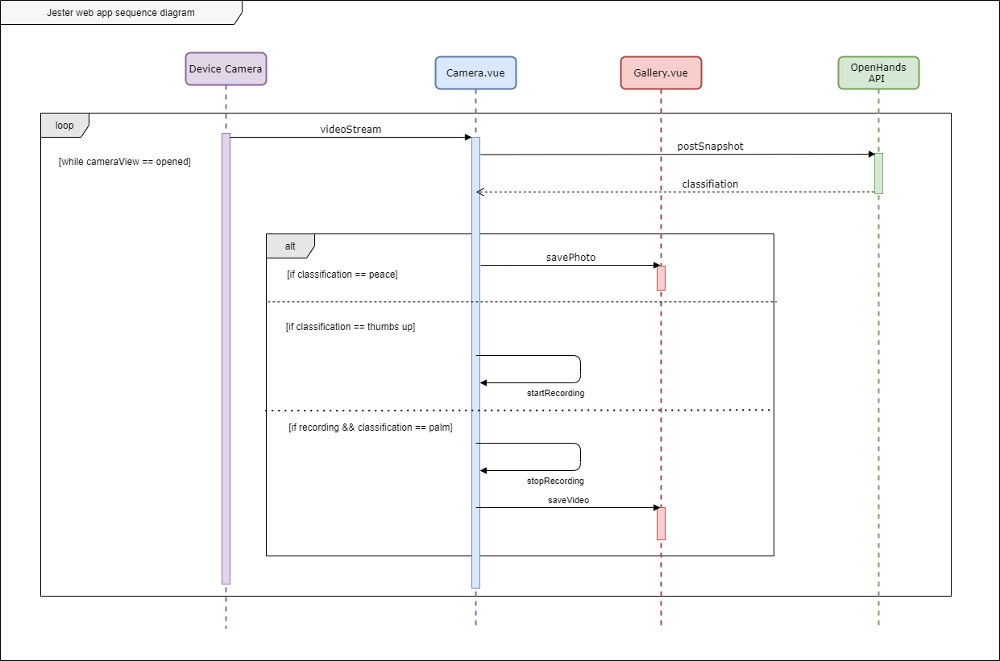
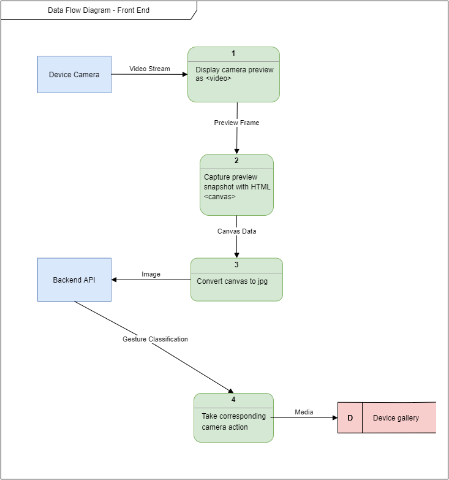
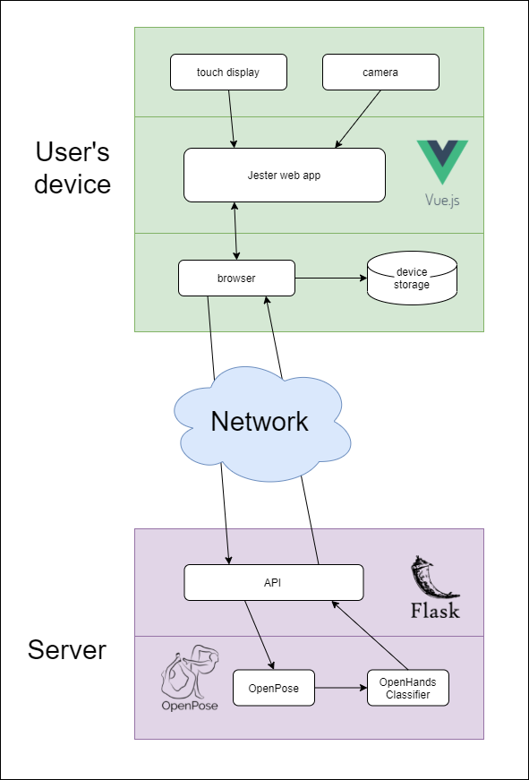

# Jester
Jester is a web app which uses OpenHands to allow users to control their device's camera using 

# How it works 




# Project setup
```
npm install
```

### Compiles and hot-reloads for development
```
npm run serve
```

### Compiles and minifies for production
```
npm run build
```
